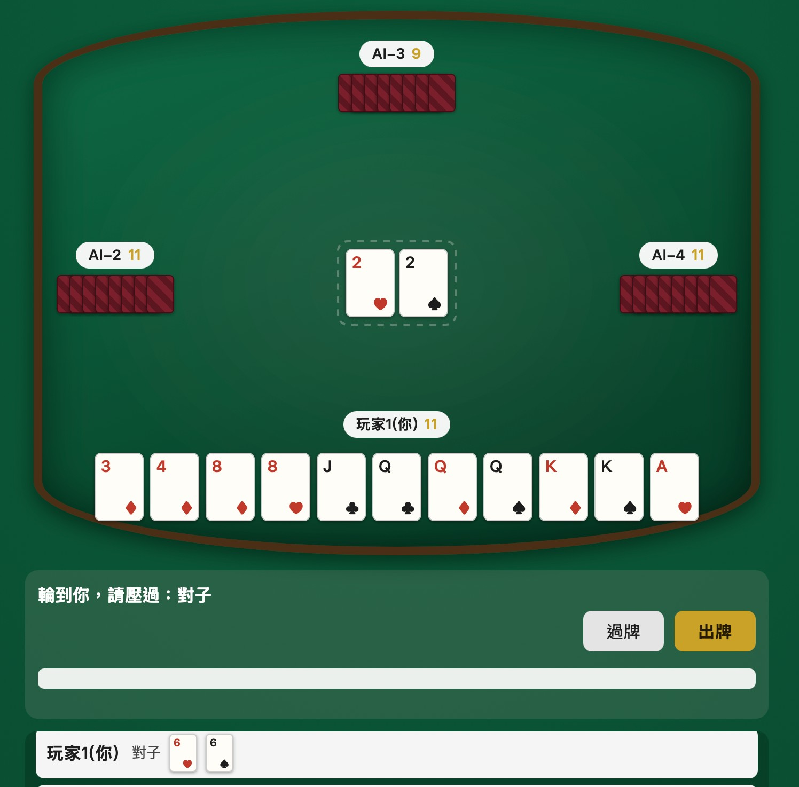

# Big2



大老二（台灣規則），2~4 人，真人玩家 0 或 1 人，其餘座位由 [jev](https://openrouter.ai/typesafe/jev-1.13)（OpenRouter 上的 decision model）擔任 AI 對手。有命令列版跟瀏覽器版，共用同一套規則與 AI 邏輯。完整規則與架構設計見 [DESIGN.md](DESIGN.md)。

## 安裝需求
- [uv](https://docs.astral.sh/uv/)
- OpenRouter API key（放在環境變數 `OPENROUTER_API_KEY`）— 只有真的要讓 AI 出牌時才需要，AI 每次出牌都會呼叫一次 jev API 並產生費用

## 執行（命令列版）
```sh
export OPENROUTER_API_KEY=sk-or-...
uv run big2
```

啟動時會互動式詢問人數與真人玩家人數，也可以用參數直接指定：
```sh
uv run big2 --players 4 --human 1   # 4 人局，1 位真人 + 3 個 AI
uv run big2 --players 2 --human 0   # 2 人局，純觀戰（AI 對打）
```

## 執行（瀏覽器版）
```sh
export OPENROUTER_API_KEY=sk-or-...
uv run big2 --server            # 預設監聽 http://127.0.0.1:8765/
uv run big2 --server --port 9000
```
啟動後打開印出來的網址即可開始，人數與真人玩家人數改在網頁上選。同一時間只支援一局（單一全域對局，沒有 session），適合一個人在自己電腦上玩，不是多人連線對戰。

## 測試
```sh
uv run pytest
```
單元測試只涵蓋牌型/發牌/回合邏輯，不會呼叫真的 jev API。

## 牌局紀錄
每場遊戲會在 `logs/game-<timestamp>.jsonl` 留下每一次 AI 呼叫的請求選項、jev 回覆、是否合法/第幾次重試，方便之後檢討 AI 表現。
